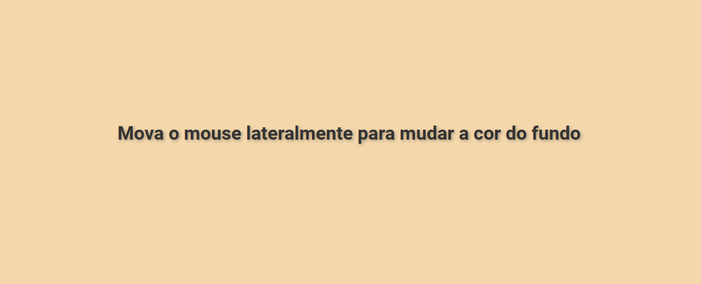

<!-- Projeto Finalizado -->
# 🎨 Background Color Changer

<p align="center">
  <!-- Contador de linguagens do GitHub -->
  
  <!-- Tamanho do repositório no GitHub -->
  
  <!-- Licença do GitHub -->
  
</p>

<div align="center">
  
</div>

## 🎯 Objetivo do Projeto

Este projeto demonstra uma página web interativa onde a cor de fundo muda dinamicamente com base na posição do mouse. O objetivo é praticar a manipulação de CSS e JavaScript para criar efeitos visuais atraentes.

## 🌐 Visualize o Projeto

Você pode visualizar o projeto online através deste [link](https://devandreotti.github.io/colorful-background/).

## 🛠️ Tecnologias Empregadas

- **HTML5**: Estrutura da página.
- **CSS3**: Estilos e layout da página.
- **JavaScript**: Manipulação da cor com base no movimento do mouse.

## 🚀 Como Executar

1. **Clone o Repositório**
   ```bash
   git clone https://github.com/seu-usuario/mudanca-cor-fundo.git
   ```

2. **Navegue até a Pasta do Projeto**
   ```bash
   cd mudanca-cor-fundo
   ```

3. **Abra o `index.html` no Navegador**
   - Simplesmente clique duas vezes no arquivo `index.html` ou arraste-o para uma nova aba do seu navegador.

## 💪 Contribuição

Contribuições são bem-vindas! Para contribuir, siga estas etapas:

1. Faça um fork do projeto.
2. Crie uma nova branch para sua feature `git checkout -b feature/nome-feature`.
3. Commit suas mudanças `git commit -m 'Adiciona nova feature'`.
4. Envie para a branch `git push origin feature/nome-feature`.
5. Abra um Pull Request.

## 📌 Nota

Este projeto é para fins educacionais. Sinta-se livre para explorar, modificar e adaptar conforme necessário.
